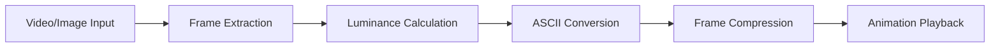

# 🎮 Ghostty-Inspired ASCII Animation Integration Specification

## Overview

This specification outlines the integration of advanced ASCII animation techniques, inspired by the Ghostty terminal project, into the Spec Kit Assistant ecosystem. The goal is to create immersive, contextual loading screens and interactive visualizations that enhance the retro terminal experience.

## 🎯 Objectives

- **Enhanced User Experience**: Transform mundane loading screens into engaging visual experiences
- **Contextual Feedback**: Provide visual indicators that match the task being performed
- **Performance Optimization**: Maintain lightweight, terminal-native animations
- **Retro Aesthetic**: Preserve and enhance the existing cyberpunk/solarpunk terminal vibes

## 📊 Technical Analysis: Ghostty Animation Techniques

### Core Concepts Adopted

#### 1. Perceptual Luminance Calculation
```bash
# CIE 1931 color space coefficients for human visual perception
luminance = 0.2126 × R + 0.7152 × G + 0.0722 × B
```

#### 2. Manhattan Distance Color Filtering
- Target specific color schemes (blue/white for Ghostty, neon colors for Spec)
- Selective pixel rendering to reduce computational overhead
- Aspect ratio correction for terminal character spacing

#### 3. Character Density Mapping
```
Brightness Levels: · ° * o O @ █
Low ────────────────────────► High
```

#### 4. Frame-based Animation System
- **24 FPS rendering** for smooth motion
- **Pre-computed frame sequences** for performance
- **Streaming playback** to minimize memory usage

## 🏗️ Architecture Overview

### Pipeline Components



### Integration Points

1. **Agent Swarm Deployment** - Real-time network topology visualization
2. **Voice Ramble Processing** - Sound wave and transcription progress
3. **Production Deployment** - Server connection and build visualization
4. **Interactive CLI** - Spec's dynamic character animations

## 🎨 Animation Categories

### 1. Loading Screen Animations

#### A. Agent Swarm Deployment
```ascii
    🤖 ┌─────┐     ┌─────┐ 🤖
       │ AI1 │◄───►│ AI2 │
    🤖 └─────┘     └─────┘ 🤖
          ▲           ▲
          │           │
    ┌─────▼─────┐   ┌─▼─┐
    │Orchestrator│◄──►│DB│
    └───────────┘   └───┘
```

**Features:**
- Animated network connections
- Agent status indicators
- Task distribution visualization
- Progress bars with ASCII charts

#### B. Voice Ramble Processing
```ascii
🎤 Recording: ▓▓▓▓▓▓▓▓░░░░░░░░ 50%
🤖 Whisper:   ▓▓▓▓░░░░░░░░░░░░ 25%
🔐 Encrypt:   ░░░░░░░░░░░░░░░░  0%

Sound Wave: ▂▃▅▇█▇▅▃▂▁▂▃▅▇█▇▅▃▂
```

**Features:**
- Real-time audio level visualization
- Transcription progress tracking
- Encryption process animation
- Sound wave representation

#### C. Production Deployment
```ascii
🌐 Seshat Connection: [████████████████████] 100%
📦 Building Project:  [██████████░░░░░░░░░░] 50%
🚀 Deploying Agents:  [███░░░░░░░░░░░░░░░░░] 15%

   ╭─── SESHAT GPU SERVER ───╮
   │  ⚡ CPU: ████████░░ 80%  │
   │  🧠 RAM: ██████░░░░ 60%  │
   │  🔥 GPU: ███████░░░ 70%  │
   ╰─────────────────────────╯
```

**Features:**
- Multi-stage deployment progress
- Resource utilization graphs
- Server status monitoring
- Success/failure state animations

### 2. Interactive Character Animations

#### A. Spec's Dynamic Presence
```ascii
      ╭─────────────────╮
      │ 🐕 Spec Says:   │
      │ "Woof! Ready    │
      │  for retro      │
      │  development!"  │
      ╰─────────────────╯
           ∩───∩
          (  ^   ^  )
           \   o   /     *tail wag*
            \_\_/_/    ~~~
```

**Features:**
- Context-aware expressions
- Tail wagging animations during success
- Thoughtful poses during processing
- Easter egg animations

#### B. Solarpunk Growth Visualizations
```ascii
Phase 1: Seed       Phase 2: Sprout     Phase 3: Growth
    🌱                  🌱                  🌿
    │                   │ \                │ \ 🍃
    │                   │  \               │  \
   ═╧═                 ═╧══╧═             ═╧══╧═🌱
```

**Features:**
- Organic growth during builds
- Ecosystem development metaphors
- Sustainable technology themes
- Nature-inspired loading states

## 🛠️ Implementation Details

### Core Animation Engine

```bash
#!/bin/bash
# Enhanced ASCII Animation Engine

# Global animation configuration
ANIMATION_FPS=24
MAX_FRAMES=120
COMPRESSION_ENABLED=true

# Luminance calculation function
calculate_luminance() {
    local r=$1 g=$2 b=$3
    echo "scale=3; 0.2126*$r + 0.7152*$g + 0.0722*$b" | bc
}

# ASCII character mapping based on brightness
map_to_ascii() {
    local luminance=$1
    local chars=("·" "°" "*" "o" "O" "@" "█")
    local index=$(echo "scale=0; $luminance * 6 / 255" | bc)
    echo "${chars[$index]}"
}

# Frame generation pipeline
generate_animation_frames() {
    local input_video="$1"
    local output_dir="$2"
    local target_colors="$3"

    # Extract frames at specified FPS
    ffmpeg -i "$input_video" -vf fps=$ANIMATION_FPS "$output_dir/frame_%04d.png"

    # Convert each frame to ASCII
    for frame in "$output_dir"/*.png; do
        convert_frame_to_ascii "$frame" "$target_colors"
    done
}

# Contextual animation dispatcher
play_contextual_animation() {
    local context="$1"
    local duration="$2"

    case "$context" in
        "agent_swarm")
            play_swarm_deployment_animation "$duration"
            ;;
        "voice_processing")
            play_voice_ramble_animation "$duration"
            ;;
        "deployment")
            play_production_deployment_animation "$duration"
            ;;
        "spec_intro")
            play_spec_character_animation "$duration"
            ;;
        *)
            play_default_loading_animation "$duration"
            ;;
    esac
}
```

### Integration with Existing Systems

#### 1. Retro-Spec Enhancement
```bash
# Enhanced retro-spec.sh integration
show_enhanced_banner() {
    # Play Spec intro animation
    play_contextual_animation "spec_intro" 3

    # Display banner with animated elements
    clear
    echo -e "${NEON_CYAN}"
    figlet "SPEC TOOLKIT" | add_glow_effect

    # Animated ASCII art borders
    animate_border_elements

    echo -e "${NEON_PINK}╔══════════════════════════════════════════════════════════════════════╗"
    echo -e "║                    🌱 SOLARPUNK DEVELOPMENT SUITE 🌱                 ║"
    echo -e "║              Conversational Co-Learning • Agent Swarms               ║"
    echo -e "║                    Voice → Research → Build → Deploy                 ║"
    echo -e "╚══════════════════════════════════════════════════════════════════════╝${RESET}"
}
```

#### 2. Agent Swarm Integration
```bash
# Enhanced swarm deployment with animations
deploy_swarm_with_visualization() {
    local swarm_type="$1"
    local scale="$2"

    # Start deployment animation
    play_contextual_animation "agent_swarm" &
    ANIMATION_PID=$!

    # Actual deployment process
    deploy_agent_swarm "$swarm_type" "$scale"

    # Stop animation and show completion
    kill $ANIMATION_PID
    show_deployment_success_animation
}
```

#### 3. Voice Ramble System Integration
```bash
# Enhanced voice processing with visual feedback
process_voice_ramble_with_animation() {
    local session_id="$1"

    # Start voice processing animation
    play_contextual_animation "voice_processing" &
    ANIMATION_PID=$!

    # Actual voice processing
    process_voice_ramble "$session_id"

    # Update animation with completion state
    kill $ANIMATION_PID
    show_voice_processing_complete
}
```

## 📈 Performance Considerations

### Optimization Strategies

1. **Frame Compression**: Use RLE encoding for repetitive patterns
2. **Lazy Loading**: Generate frames on-demand for infinite animations
3. **Terminal Detection**: Adapt complexity based on terminal capabilities
4. **Memory Management**: Stream frames instead of loading all into memory
5. **Fallback Options**: Simple spinners for low-performance environments

### Resource Requirements

- **CPU**: Minimal overhead with pre-computed frames
- **Memory**: < 1MB for typical animation sequences
- **Storage**: Compressed frame data < 100KB per animation
- **Dependencies**: ffmpeg, ImageMagick (optional for custom content)

## 🎪 Easter Eggs and Interactive Elements

### Special Animation Triggers

```bash
# Konami code sequence
konami_sequence="up up down down left right left right B A"

# Matrix mode activation
matrix_mode_animation() {
    # Digital rain effect with custom characters
    # Real-time data stream visualization
}

# Coffee break animation
coffee_break_animation() {
    # Retro coffee cup ASCII art
    # Steam animation using particle system
}

# Train animation (sl command style)
spec_train_animation() {
    # ASCII train with Spec as conductor
    # Cargo cars representing different tools
}
```

### Context-Aware Responses

- **Success States**: Spec celebrates with tail wagging
- **Error States**: Spec looks concerned, offers helpful suggestions
- **Loading States**: Spec appears busy, shows progress indicators
- **Idle States**: Spec sleeps peacefully with breathing animation

## 🚀 Implementation Roadmap

### Phase 1: Foundation (Week 1-2)
- [ ] Implement core animation engine
- [ ] Create basic frame generation pipeline
- [ ] Develop character density mapping system
- [ ] Build contextual animation dispatcher

### Phase 2: Integration (Week 3-4)
- [ ] Enhance retro-spec with dynamic animations
- [ ] Integrate with agent swarm deployment
- [ ] Add voice processing visualizations
- [ ] Implement production deployment animations

### Phase 3: Polish (Week 5-6)
- [ ] Add easter eggs and interactive elements
- [ ] Optimize performance and memory usage
- [ ] Create fallback options for low-spec terminals
- [ ] Comprehensive testing across terminal types

### Phase 4: Enhancement (Week 7-8)
- [ ] Custom video-to-ASCII conversion tools
- [ ] Advanced solarpunk growth animations
- [ ] Interactive Spec character development
- [ ] Community animation contributions

## 📋 Testing Strategy

### Compatibility Matrix

| Terminal | Color Support | Animation Support | Performance |
|----------|---------------|-------------------|-------------|
| iTerm2   | ✅ Full       | ✅ Excellent      | ⚡ Fast     |
| Terminal.app | ✅ Good    | ✅ Good           | ⚡ Fast     |
| Termux   | ✅ Good       | ✅ Good           | 🐌 Medium   |
| SSH      | ⚠️ Limited    | ⚠️ Basic          | 🐌 Slow     |

### Performance Benchmarks

- **Frame Rate**: Target 24fps, fallback to 12fps on slower systems
- **Memory Usage**: < 1MB for active animations
- **CPU Overhead**: < 5% on modern systems
- **Startup Time**: < 500ms for animation initialization

## 🌱 Future Enhancements

### Advanced Features
- **AI-Generated Animations**: Dynamic content based on context
- **Community Contributions**: User-submitted animation sequences
- **Adaptive Quality**: Automatic adjustment based on system performance
- **Multi-Language Support**: Animations that work with different character sets

### Integration Opportunities
- **GitHub Actions**: Build status animations
- **CI/CD Pipelines**: Deployment progress visualization
- **Monitoring Dashboards**: Real-time system health animations
- **Educational Content**: Interactive coding tutorials with Spec

## 📚 References

1. **Ghostty Animation Article**: [Making the Ghostty Animation](https://pierce.dev/notes/making-the-ghostty-animation/)
2. **CIE 1931 Color Space**: Perceptual luminance calculation standards
3. **Terminal Graphics**: ANSI escape codes and cursor control
4. **ASCII Art Techniques**: Character density mapping and visual representation

---

**Specification Version**: 1.0
**Last Updated**: September 27, 2025
**Status**: Proposal - Ready for Implementation
**Estimated Effort**: 8 weeks (part-time development)

🐕 **Spec says**: *"Woof! This is going to make our terminal experience absolutely delightful! Let's build something that makes developers smile every time they see a loading screen!"* 🎮✨